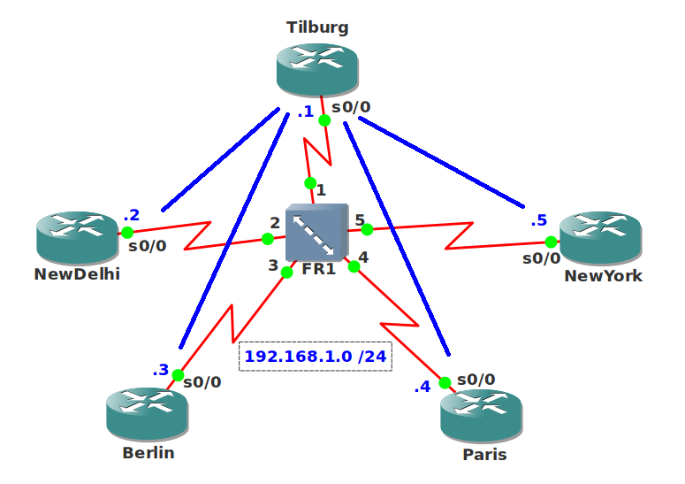

# EIGRP Hybrid Bandwidth Pacing

## Scenario

A large international ISP has hired you as one of their network engineers. The ISP still has a fairly large customer that is using an older frame-relay network. All of your colleagues are too busy working with MPLS and you are the only one who is capable of fixing frame-relay problems. The ISP wants you to look at the frame-relay network because there have been some congestion problems with EIGRP. It's up to you to configure the most optimal settings!

## Goal

* The frame-relay switch has been preconfigured for you.
* Router Tilburg is the Hub router and all other routers are the spoke routers.
* Router NewDelhi, Berlin and Paris each have a PVC with a CIR of 256kbps.
* Router NewYork has a PVC with a CIR of 128kbps.
* Every router has a loopback0 interface:
  * Tilburg: 1.1.1.1 /24
  * NewDelhi: 2.2.2.2 /24
  * Berlin: 3.3.3.3 /24
  * Paris: 4.4.4.4 /24
  * NewYork: 5.5.5.5 /24
* Configure frame-relay and EIGRP AS 1 on all routers with the most optimal settings for this network.

## IOS

`c3640-jk9s-mz.124-16.bin`

## Topology

