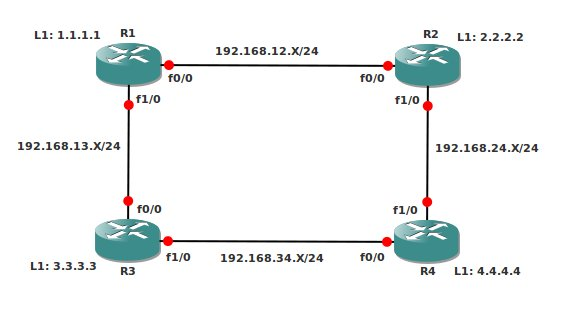

# EIGRP Intermediate

## Scenario

You and a colleague network administrator were talking about the scalability and flapping network issues that you have encountered in the past. Especially the stories about EIGRP stuck-in-active make you shiver. On your network you are using EIGRP as a routing protocol, and you have heard that summarization and stub routers might solve some of your problems. Time for some good old lab action!

## Goal

- Achieve full connectivity, every IP Address should be pingable from any router.
- When you ping 1.1.1.1 from R4 it should take the path through R2.
- Change the EIGRP Metrics so load/reliability are also used in addition to bandwidth and delay.
- Disable EIGRP auto-summary.
- Create 4 extra loopbacks on R3:
  - Loopback10: 172.16.0.1 /24
  - Loopback11: 172.16.1.1 /24
  - Loopback12: 172.16.2.1 /24
  - Loopback13: 172.16.3.1 /24
- Advertise these networks in EIGRP, the routing table on R1, R2 and R4 should only show a single entry for these networks: 172.16.0.0/22
- Create a default route on R1, if you look at the routing table on R2, R3 or R4 it should show the default route pointing to R1.
- Change the bandwidth on R2 on FastEthernet0/0 to 100. Make sure you only see 1 entry for the 1.1.1.0 network in R4.
- Without modifying R2, make sure R4 has 2 entries for the 1.1.1.0 network, one by going through R2, the other one through R3. Only use EIGRP or bandwidth commands to achieve this.
- Enable authentication between R1 and R2:
  - key-chain: CISCO
  - key-string: PASSWORD
- Disable the link between R3 and R4.
- Make sure that when you type 'shutdown' on Loopback1 at R2, R1 will not send a QUERY to R3. (hint: to check this, do a 'debug eigrp packets query reply')

## IOS

c3640-jk9s-mz.124-16.bin

## Topology
