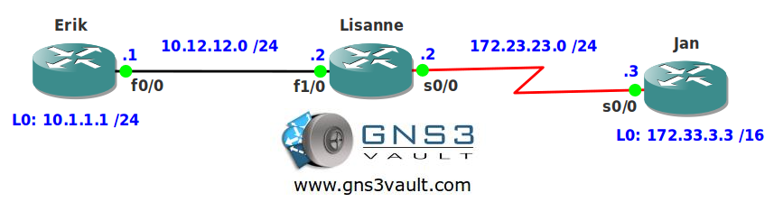

# EIGRP IP Default Network

## Scenario

As the network engineer for your Cisco-only network you run into a strange problem. Some of the routers have been replaced and have empty configs and per configuration template you need to configure EIGRP IP Default Network. Some of the older routers still run IGRP and are unable to advertise default routes, in order to keep all configs on routers the same you are forced to use the older "IP Default Network command". One of your colleagues still has an output from an old "show ip route" command which will show you what you need to achieve.

## Goal

- All IP addresses have been preconfigured for you.
- Configure EIGRP AS12 as following:
  - Do not disable auto-summarization.
  - Advertise network 172.23.23.0 /24
  - Advertise network 10.12.12.0 /24
  - Do not use any other network commands.
- You have completed this lab when you see the following when you type "show ip route" on router Erik:

**Gateway of last resort is 10.12.12.2 to network 172.33.0.0**

---

## IOS

c3640-jk9s-mz.124-16.bin

## Topology

## Video Solution

[Watch on YouTube](http://www.youtube.com/watch?v=5ldJuSs7PlY)
