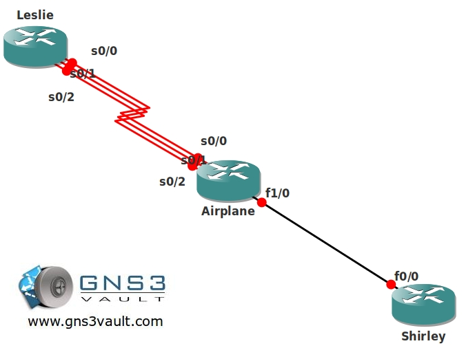

# EIGRP Maximum Path and Variance

## Scenario

As a fan of comedy movies you are making sure your network is optimized so you can send videos without any disruptions in the network. You heard EIGRP (Enhanced Interior Gateway Routing Protocol) is a good choice since the failover speed is low and it's able to load balance between unequal paths. There are 3 different serial links and you want to make the optimal use of them. Whenever a link fails you need to make sure the routing protocol converges as soon as it can....surely you can solve this!

## Goal

* All IP addresses have been preconfigured for you:
  * Leslie: 192.168.X.1 /24 (.1 - .2 & .3 on serial links)
  * Leslie L0: 1.1.1.1 /24
  * Airplane: 192.168.X.2 /24 (.1 - .2 & .3 on serial links)
  * Airplane F0/0: 192.168.23.2 /24
  * Shirley F0/0: 192.168.23.3 /24
  * Shirley L0: 3.3.3.3 /24

* Configure EIGRP AS123 on all routers, advertise all networks.
* You are not allowed to make changes to the K values or Bandwidth on interfaces.
* Disable EIGRP auto-summarization.
* Make sure that only S0/0 and S0/1 are visible in the routing table and used for sending traffic.
* When S0/0 and S0/1 both fail make sure that S0/2 takes over.

## IOS

* c3640-jk9s-mz.124-16.bin

## Video Solution

* http://www.youtube.com/watch?v=CafZ1eQ5CEY
