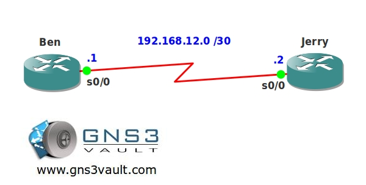

# EIGRP MD5 Authentication

## Scenario

Ben and Jerry are running their business from the north pole and have an icy request for you. They would like you to setup EIGRP (Enhanced Interior Gateway Routing Protocol) and make sure that all network updates are secure by enabling authentication...don't get cold fingers on this one, time to warm up the routers!

## Goal

- All IP addresses have been preconfigured for you.
- Both routers has a loopback0 interface:
  - Ben: 1.1.1.1 /24
  - Jerry: 2.2.2.2 /24
- Configure the correct date and time for both routers. Just configure today's date/time.
- Configure EIGRP AS 12 on both routers, advertise all networks.
- Ensure you have an adjancency and routing information is exchanged.
- Enable MD5 authentication for EIGRP AS 12 with the following parameters:
  - Key Chain: GNS3VAULT
  - Key-ID 1: password chunky
  - Key-ID 2: password monkey
- Key1 should be valid from today until 15 minutes later from the moment you configure it.
- Key2 should be valid from today and will never expire.
- Ensure routing information is still exchanged between both routers.

## IOS

c3640-jk9s-mz.124-16.bin

## Topology

## Video Solution

http://www.youtube.com/watch?v=msebqIer_wk
