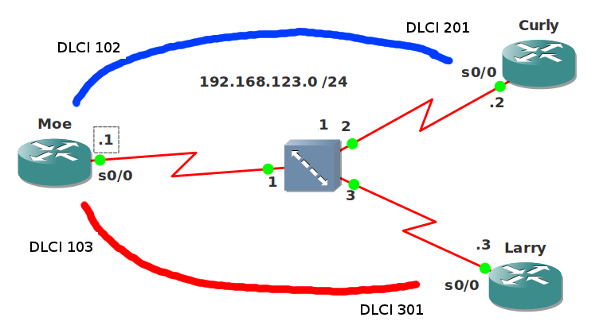

# EIGRP over Frame-Relay with Multipoint interface

## Scenario

A couple of stooge network engineers are trying to configure EIGRP over the frame-relay network. They read all about frame-relay, EIGRP and split-horizon and decided it sounded like a good idea to use sub-interface. Unfortunately things are not working as they should. Do you think you can help them out?

## Goal

* All IP addresses have been preconfigured for you as specified in the topology picture except for router Moe.
* Every router has a loopback0 interface:
  * Moe: 1.1.1.1 /24
  * Curly: 2.2.2.2 /24
  * Larry: 3.3.3.3 /24
* You are not allowed to make any changes to the frame-relay configurations.
* Configure a multipoint sub-interface on router Moe.
* Configure EIGRP AS 123 on all routers and advertise the loopback interfaces.
* Ensure router Curly and Larry can see each other's loopback interfaces. Test this by sending a ping that is sourced from the loopback0 interfaces and destined for the other loopback0 interface.

## IOS

c3640-jk9s-mz.124-16.bin

## Topology

