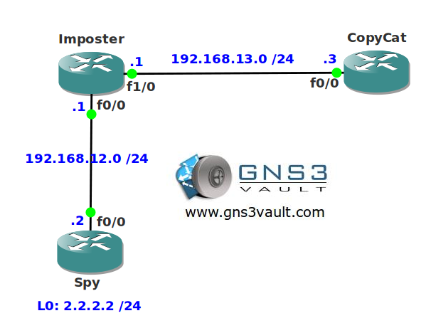

# EIGRP Router ID

## Scenario

Your colleague asks for your help with a strange EIGRP problem. He redistributed a network into EIGRP but for some reason it doesn't show up in the routing table of one of the routers. You verify the redistribution commands are looking good and there are filters in action. Let's see if you can find the root of this problem...

## Goal

* All IP addresses have been preconfigured for you.
* Configure EIGRP on all FastEthernet interfaces.
* Redistribute the loopback interface on router Spy into EIGRP.
* Ensure router CopyCat does not see network 2.2.2.0 /24 in it's routing table without applying any filtering techniques.

## IOS

c3640-jk9s-mz.124-16.bin

## Topology

## Video Solution

http://www.youtube.com/watch?v=Ez1QBxA0Eck
