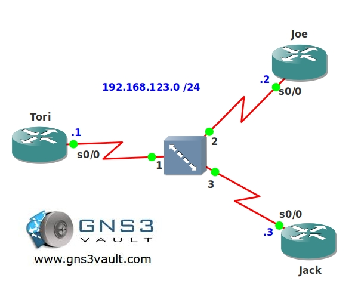

# EIGRP Split Horizon

## Scenario

Jack and Joe both have important information to share with each other but they don't have a direct connection between them. Tori agreed to help out and so they setup a Frame-Relay network to share information. EIGRP (Enhanced Interior Gateway Routing Protocol) is used as the routing protocol to dynamically learn new networks. Configuring EIGRP should be straight forward but Joe and Jack are complaining that they are unable to reach other's networks...time for you to fix it!

## Goal

- All IP addresses have been preconfigured for you.
- Every router has a loopback0 interface:
  - Tori: 1.1.1.1 /24
  - Joe: 2.2.2.2 /24
  - Jack: 3.3.3.3 /24
- You are not allowed to make any changes to the frame-relay configurations.
- Configure EIGRP AS 123 on all routers, advertise all networks.
- Ensure router Joe and Jack can see each other's loopback interfaces. Test this by sending a ping that is sourced from the loopback0 interfaces and destined for the other loopback0 interface.

## IOS

- c3640-jk9s-mz.124-16.bin

## Topology

## Video Solution

[EIGRP Split Horizon Video Solution](http://www.youtube.com/watch?v=gGet_AF-Vac)
