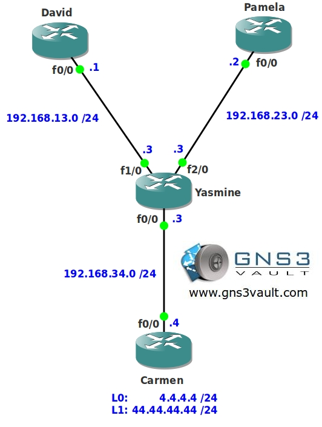

# EIGRP Stub Leak Map

## Scenario

You are enjoying life as a lifeguard and parttime network administrator. Just like real life your routers cry out for help by sending queries whenever they have lost a certain network. You decide to implement EIGRP Stub routing and only allow some of the networks to be advertised. Now you have another problem...people are complaining about reachability..up to you to be there and fix it!

## Goal

- All IP addresses have been preconfigured for you.
- Router Yasmine has a loopback interface: Loopback0: 3.3.3.3 /24
- Router Carmen has 2 loopback interfaces: Loopback0: 4.4.4.4 /24 and Loopback1: 44.44.44.44 /24
- Configure router Yasmine so only the directly connected networks are advertised towards the neighbors.
- Router David and Pamela should have 4.4.4.0 /24 in their routing table, learned from EIGRP.
- 44.44.44.0 /24 is not allowed to be in the routing table of router David and Pamela.

## IOS

c3640-jk9s-mz.124-16.bin

## Topology

You need to register to download the GNS3 Topology File. (Registration is Free!)

## Video Solution

http://www.youtube.com/watch?v=VRsVKQLupSs
