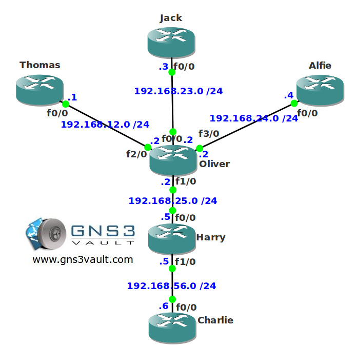

# EIGRP Stub

## Scenario:

A major soccer team in the UK is running EIGRP on their internal network. One of your colleague network engineers noticed that there are quite some EIGRP routers sending query packets and sometimes routers get stuck-in-active. Since you are an expert on EIGRP you'll have to configure the network using the EIGRP stub feature to make sure things work smoother...good luck!

## Goal:

- All IP addresses have been preconfigured as specified in the topology picture.
- Each router has a loopback0 interface.
- Use EIGRP AS 1 to configure on your routers.
- Configure router Thomas so it receives EIGRP routes but doesn't advertise anything.
- Configure router Harry so it only receives EIGRP routes and only advertises directly connected networks in EIGRP.
- Configure router Alfie so it only receives EIGRP routes and only advertises summary route 4.4.0.0 /16 in EIGRP.
- Configure router Jack so it only receives EIGRP routes and only advertises static routes.

## IOS:

c3640-jk9s-mz.124-16.bin

## Topology:

## Video Solution:

[Video Solution on YouTube](http://www.youtube.com/watch?v=ZMryQNCkOIY)
