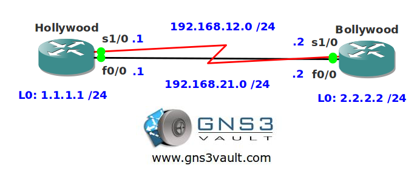

# EIGRP Summarization Leak-Map

## Scenario

The movie industry is dominated by Holly- and Bollywood. Recently the two companies are creating movies together and using a shared network infrastructure. To make sure the routing tables of the EIGRP routes don't grow too much you decide to implement summarization. This has a unwanted side-effect however since now the serial-link is used to reach some networks.

## Goal

- All IP addresses have been preconfigured for you.
- Configure EIGRP on both routers and advertise everything. Activate it on both interfaces.
- Create a summary advertising a default route on router Bollywood using the FastEthernet 0/0 interface.
- Ensure router Hollywood doesn't use the serial link to reach network 2.2.2.0 /24. You are not allowed to create any static routes.

## IOS

- c3640-jk9s-mz.124-16.bin

## Topology

## Video Solution

- [Watch on YouTube](http://www.youtube.com/watch?v=QLJqR4klOfc)
