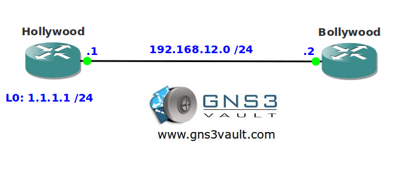

# EIGRP Summarization without Null0

## Scenario

You are applying for a job as a senior network engineer at a large ISP. They heard you passed your CCIE so they want to test you by giving a topology with an EIGRP summarization question. Let's see if you can work your way out of this one...

## Goal

- All IP addresses have been preconfigured for you.
- Configure EIGRP on all interfaces.
- Advertise a 1.1.0.0 /16 summary on router Hollywood on any interface.
- Ensure no null0 entry is installed in the routing table of router Hollywood.
- You are not allowed to use static or default routes.

## Additional Information

## IOS

- **Image**: c3640-jk9s-mz.124-16.bin

## Topology

## Video Solution

- [YouTube Video Solution](http://www.youtube.com/watch?v=y7Lr_KjY_O4)
