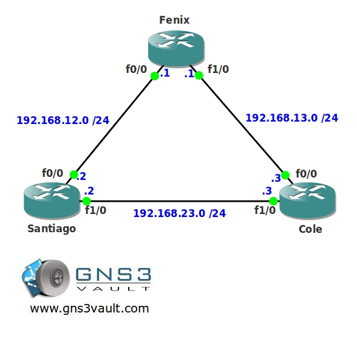

# EIGRP Summarization

## Scenario

The owner of this network has been complaining about performance issues for awhile. You as the junior network engineer have just learned about summarization and the possible advantages this might bring to your network. It's up to you to bring summarize the networks and bring the glory back to the routers...

## Goal

- All IP addresses have been preconfigured for you.
- EIGRP AS123 has been preconfigured for you and is advertising all networks.
- There are plenty of loopbacks with IP addresses configurated for you to summarize.
- You are not allowed to use EIGRP auto-summarization.
- Ensure router Cole and Santiago only have a single 172.16.0.0 /21 entry in their routing table.
- Ensure router Fenix will send traffic for 3.3.3.3 towards router Santiago. Do not change the Administrative Distance or Metric(s) to achieve this.
- Ensure router Fenix only sees 2 entries for the 10.0.0.0 network range. 10.0.0.0 /22 and 10.0.4.0 /22.
- Further summarize the 10.0.0.0 /22 and 10.0.4.0 /22 network so router Fenix and Cole only see the 10.0.0.0 /19 entry in their routing table.
- Advertise a default route on router Cole towards router Fenix, you are not allowed to use the default-network command.

## IOS

c3640-jk9s-mz.124-16.bin

## Topology

## Video Solution

[EIGRP Summarization Video Solution](http://www.youtube.com/watch?v=2LQ8iamyJ4w)
