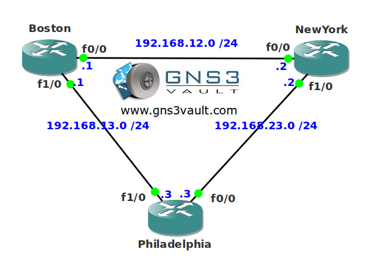

# EIGRP Timers

## Scenario

You are the network engineer for a fairly large international operating company. One of the trainees in the company is studying for his CCNA and decided to practice on some of the company routers. EIGRP is now messed up and it's up to you to reconfigure the timers again.

## Goal

* All IP addresses have been preconfigured for you.
* Configure EIGRP on all interfaces.
* Router Boston should have a holddown timers of 9 seconds for all neighbors.
* Router NewYork should send an EIGRP hello packet every 5 seconds to router Philadelphia.
* Configure EIGRP so lost routes are stuck-in-active if you don't get a reply to your query in 2 minutes.

## IOS

c3640-jk9s-mz.124-16.bin

## Topology

## Video Solution

http://www.youtube.com/watch?v=wCuPubjZ7YQ
