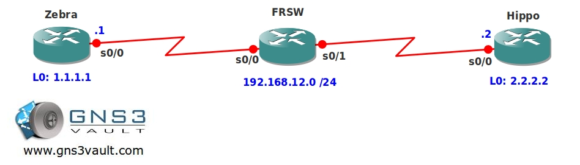

# EIGRP Unicast

## Scenario

You are working as a trainee for an old service provider. Currently the network has a frame relay network which is still very popular among the customers. The service provider wants to replace the static routes from the past and use Cisco EIGRP (Enhanced Interior Gateway Routing Protocol). Up to you to implement this without changing any of the frame-relay configurations.

## Goal

- The frame-relay switch has been preconfigured for you, there is only a single PVC: Router Zebra to Hippo
  - Zebra: DLCI 102
  - Hippo: DLCI 201
- Do not change any of the frame-relay configurations.
- IP Addresses have been preconfigured for you.
  - **Router Zebra:**
    - S0/0: 192.168.12.1 /24
    - L0: 1.1.1.1 /24
  - **Router Hippo:**
    - S0/0: 192.168.12.2 /24
    - L0: 2.2.2.2 /24
- Configure EIGRP and advertise the serial and loopback interfaces.
- Ensure you establish a neighbor adjacency and are able to ping each others loopback interface.

## IOS

- c3640-jk9s-mz.124-16.bin

## Topology

## Video Solution

[EIGRP Unicast Video Solution on YouTube](http://www.youtube.com/watch?v=Pu3uNBZDhfA)
