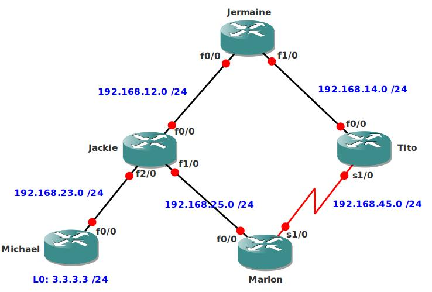

# EIGRP Variance Traffic Engineering

## Scenario

You are the senior network engineer for a company specialized in 80's pop-music. The network is experiencing congestion and you want to use one of the WAN links to share the bandwidth so the load on the main Fast Ethernet link will decrease....let's boogy!

## Goal

- All IP addresses have been preconfigured as specified in the topology picture.
- Configure EIGRP on all routers, disable auto-summary. Achieve full connectivity.
- Change the EIGRP metrics so only delay is being used for the calculations.
- Change the delay on every interface (including the loopback) to 300usec
- If you send a ping from router Jermaine to the loopback of router Michael it should use the link to router Jackie. (succesor route)
- Change the delays on the routers so the link between Jermaine and Tito becomes a feasible succesor route to reach the loopback.
- Change the delays so traffic will be sent in a 1:5 ratio. Use the "show ip route 3.3.3.0" command to check this.

## Additional Resources

## IOS

- c3640-jk9s-mz.124-16.bin

## Topology

## Video Solution

http://www.youtube.com/watch?v=SJ-HzMR6tV8
