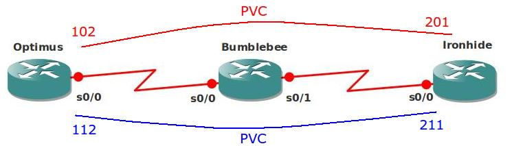

# Basic Frame-Relay Switch

## Scenario

You are working for a huge international car company as the senior network engineer. Recently the Frame-relay switch of one of your WAN links died and you decided to replace it with a Cisco Router.

## Goal:

- Take a good look at the topology before you start configuring.
- The blue/red lines are PVC's (Permanent Virtual Circuit).
- DLCI numbers are shown on the topology picture.
- Enable frame-relay switching on Router Bumblebee.
- Configure the correct PVC's.
- Using the 'show frame-relay route' command on Router Bumblebee should show both PVC's as 'active'.
- Using the 'show frame-relay map' command on Router Optimus or Ironhide should show both PVC's as active.
- Optional: Try to achieve the same result without using the 'frame-relay route' command.

## IOS:

c3640-jk9s-mz.124-16.bin

## Topology:

## Video Solution:

http://www.youtube.com/watch?v=mJe18NW-V3Y
