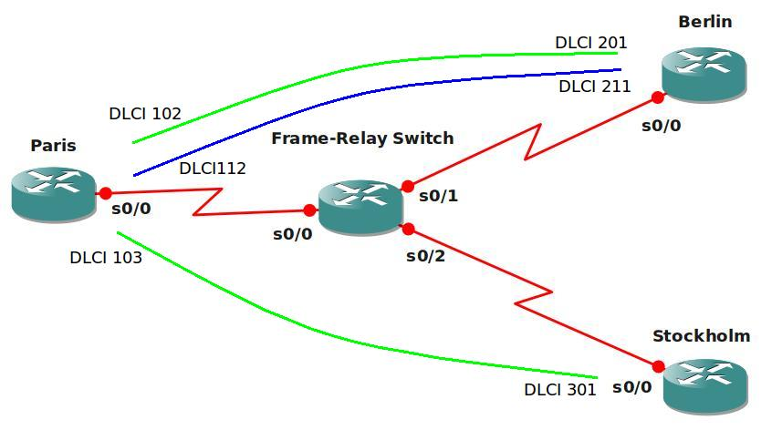

# Frame-Relay Basics

## Scenario

As a CCNA candidate you are familiar with the concept of Frame-Relay, although you do not need to configure the Frame-Relay switch. Since you are working your way to becoming the ultimate networking Guru, you are prepared to do a full Frame-Relay config....that includes the Frame-Relay Switch! Configuring a point-to-multipoint and point-to-point PVC and having ip connectivity is your goal.

## Goal

* Take a good look at the topology before you start configuring.
* The green lines are PVC's (Permanent Virtual Circuit) and this is supposed to be a point-to-multipoint.
* Paris should be the "hub" and Berlin and Stockholm are "spoke" routers.
* The blue line is a point-to-point PVC between Paris and Berlin.
* DLCI numbers are shown on the topology picture.
* Use the 192.168.123.0 /24 subnet for the point-to-multipoint connection, use a subinterface.
* Use the 192.168.12.0 /24 subnet for the point-to-point connection, use a subinterface.
* Achieve full IP connectivity, all ip addresses should be pingable.

## IOS

c3640-jk9s-mz.124-16.bin

## Topology

## Video Solution

[Frame-Relay Basics Video Solution](http://www.youtube.com/watch?v=77J47L5FQNI)
