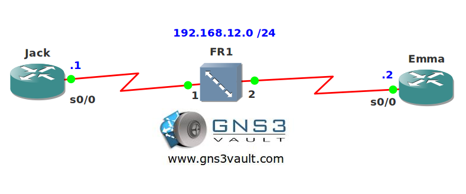

# Frame Relay Static Mapping

## Scenario

Jack and Emma are using an old frame-relay switch to connect their routers. Unfortunately they are unable to get any connection. Think you can help them out?

## Goal

* All IP addresses have been preconfigured for you.
* Disable frame relay inverse ARP.
* Configure frame relay mappings so the routers can ping each other.
* Frame relay should support broadcast emulation.

## IOS

c3640-jk9s-mz.124-16.bin

## Topology

## Video Solution

[Video on YouTube](http://www.youtube.com/watch?v=h45467tCo3w)
