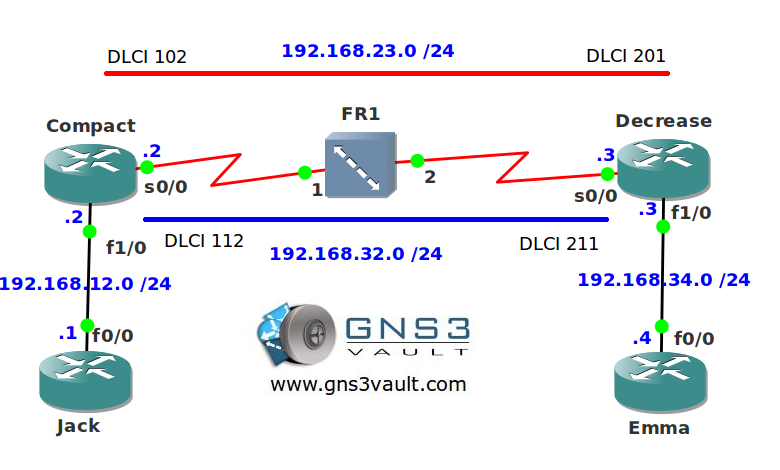

# Frame Relay TCP and RTP compression

## Scenario

You are working at a frame relay provider as the senior network engineer. One of your customers has two PVCs and they are running a lot of TCP and RTP sessions through your frame relay network. The PVCs only have a CIR of 64kbps and you have plenty of CPU power on router Compact and Decrease. Let's see what you can squeeze out of those packets...

## Goal

- All IP addresses have been preconfigured for you.
- Configure two point-to-point subinterfaces for frame relay on router Compact and Decrease.
- Use network 192.168.23.0 /24 for DLCI 102 - 201.
- Use network 192.168.32.0 /24 for DLCI 112 - 221.
- Ensure traffic to router Jack uses network 192.168.23.0 /24 for the next-hop.
- Ensure traffic to router Emma uses network 192.168.32.0 /24 for the next-hop.
- Enable RTP compression for the PVC with DLCI 102 - 201.
- Enable TCP compression for the PVC with DLCI 112 - 221.

## IOS

- **Image:** c3640-jk9s-mz.124-16.bin

## Topology

## Video Solution

[YouTube Video: Frame Relay TCP and RTP Compression](http://www.youtube.com/watch?v=xQCrEdV--DU)
