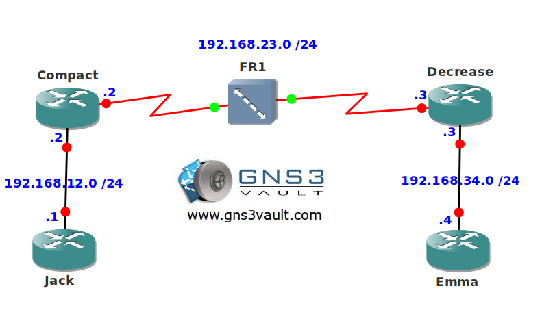

# PPP over Frame Relay

## Scenario

You are a network engineer specialized in frame-relay. The ISP you work for has a new security policy and wants that all frame-relay connections run authentication. Unfortunately this is not possible so you prepare to configure PPP over frame-relay. Using PPP will ensure you can add authentication in the future.

## Goal

- All IP addresses have been preconfigured for you.
- Configure a virtual template on router Compact and Decrease and configure network 192.168.23.0 /24 on it.
- Configure the serial0/0 interfaces for frame relay and use the virtual-template and PPP.
- Ensure router Jack and Emma can ping each other through the PPP over frame relay network.

## IOS

c3640-jk9s-mz.124-16.bin

## Topology

## Video Solution

http://www.youtube.com/watch?v=U2FlZaBP-3s
