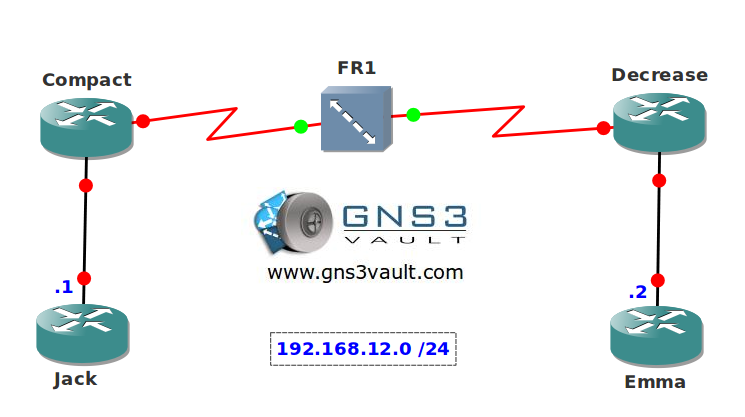

# Transparent Bridging over Frame Relay

## Scenario

Your work for a large ISP that still has some old frame-relay equipment. One of your customers wants their sites to be directly connected. Since you know frame relay pretty well you know you can setup some bridging.

## Goal

* All IP addresses have been preconfigured for you.
* Enable frame relay encapsulation on the serial0/0 interfaces of router Compact and Decrease.
* Configure a bridge group on router Compact and Decrease, use IEEE. Apply the bridge group to the serial0/0 interfaces.
* Ensure router Jack and Emma can ping each other and that they have multicast and broadcast capabilities.

## IOS

c3640-jk9s-mz.124-16.bin

## Topology

## Video Solution

[http://www.youtube.com/watch?v=J0epdnR5DY4](http://www.youtube.com/watch?v=J0epdnR5DY4)
