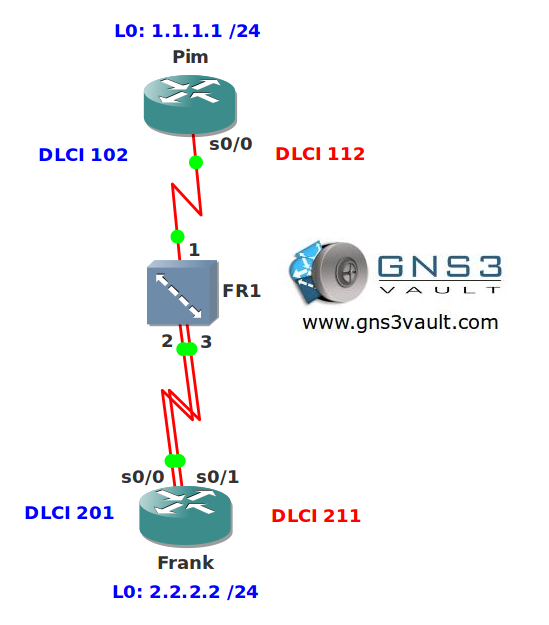

# Multilink PPP over Frame Relay

## Scenario

You are the senior network engineer working at a major frame relay ISP somewhere in Europe. One of your customers requests the company to run authentication over their frame relay connections and they would also like to see fragmentation. You know there is no way to do authentication with frame-relay so you decide to bundle their PVCs in a multilink PPP setup.

## Goals

- There are two PVCs using DLCI 102 + 201 and DLCI 112 + 211.
- Configure Multilink PPP to run over both PVCs. Use network 192.168.12.0 /24.
- Ensure packets will be fragmented on both serial links.
- Configure CHAP authentication for the PPP Multilink configuration.
- Ensure both routers can reach each others loopback0 interfaces through the PPP Multilink.

## IOS

c3640-jk9s-mz.124-16.bin

## Topology

## Video Solution

[YouTube Video Solution](http://www.youtube.com/watch?v=U6iM3jM_gVI)
