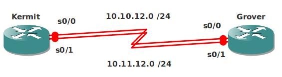

# PPP Authentication

## Scenario

The puppet business is becoming more popular everyday and that's why your boss decided to have redundant links between the 2 sites. Since they are afraid of company espionage you also need to configure authentication.

## Goals

- All IP addresses have been preconfigured as specified in the topology picture.
- Configure both links for encapsulation PPP.
- Use PAP authentication on the 10.10.12.0 link, use password "VAULT".
- Use CHAP authentication on the 10.11.12.0 link, use password "CISCO".

## IOS

c3640-jk9s-mz.124-16.bin

## Topology

## Video Solution

http://www.youtube.com/watch?v=tmesuyp9qmc
