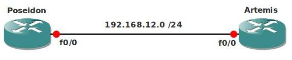

# PPP over Ethernet (PPPOE)

## Scenario

You are working for a small company as a network engineer and currently you are still using a dial-up modem for Internet access. The company will upgrade the Internet access to a DSL connection and your service provider promised they will send you a Cisco 800 series router so you can configure it already for PPPoE. The problem is you never configured PPPoE before so it's time to upgrade your skills!

## Goals

- Do not configure any IP address on the Fast Ethernet interfaces.
- Router Artemis will be the PPPoE server (to emulate the service provider)
- Configure a DHCP pool on Router Artemis for the PPP connection, use the 192.168.12.0 subnet.
- Configure Router Artemis as a PPPoE server using the DHCP pool you just created. Use a Virtual-Template and configure the 192.168.12.2 IP address on this router.
- Router Poseidon should get IP address 192.168.12.1 from the PPPoE server.
- Configure Router Poseidon as the PPPoE Client.
- Your end result should be a working PPPoE session and Router Poseidon should get an IP address from DHCP.
- When your PPPoE connection is working, configure CHAP authentication:
  - Username: Poseidon
  - Password: VAULT
- Optional: Configure Router Artemis so PPPoE clients cannot initiate more than 5 sessions within 1 minute for 10 minutes.

## IOS

c3640-jk9s-mz.124-16.bin

## Topology

## Video Solution

[YouTube: PPP over Ethernet (PPPoE) Configuration](http://www.youtube.com/watch?v=vaWXeZHFXvI)
