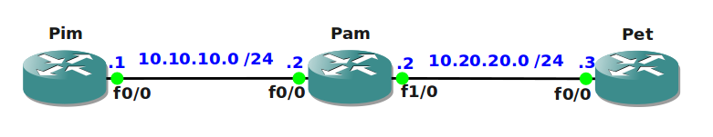

# IPv6 6to4 Tunneling

## Scenario

The largest ISP in Europa has acquired you as their main IPv6 specialist. To ensure connectivity for all customers the ISP has used static tunneling in order to send IPv6 packets through the IPv4 network. They want you to change this and make life a bit easier by creating dynamic tunneling...let's see if you can nail this one.

## Goal

- All IPv4 and IPv6 addresses have been preconfigured for you.
- Router Pim has a loopback0 interface with the 2001:1::1/64 IPv6 address.
- Router Pet has a loopback0 interface with the 2001:3::3/64 IPv6 address.
- You are not allowed to make any changes on router Pam.
- Configure a tunnel between router Pim and Pet, you are not allowed to specify a "tunnel destination" address.
- Ensure you can ping each other's loopback0 interfaces on router Pim and Pet through the tunnel interface.

**NOTE:** If you have trouble calculating the IPv4 address in hexadecimal you can use the `ipv6 general-prefix MYPREFIX 6to4 fastethernet0/0` command.

## IOS

c3640-jk9s-mz.124-16.bin

## Topology

## Video Solution

[YouTube Video](http://www.youtube.com/watch?v=4EWn9amnTmA)
