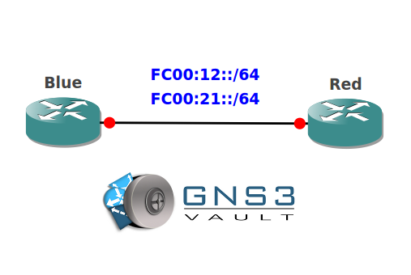

# IPv6 Autoconfiguration

## Scenario

You are working as the network engineer for an Asian based company and responsible for the deployment of IPv6. You heard some good things about this new protocol and are interested in the new autoconfiguration feature, let's see if you can configure this.

## Goal

* Configure the unique local address FC00:12:0::1/64 on router Red's f0/0 interface.
* Configure an additional local address FC00:21:0::1/64 on router Red's f0/0 interface.
* Configure router Red to broadcast both prefixes using ICMPv6 Neighbor Discovery Router Advertisements (ND RA) but make sure only FC00:12::/64 is used for autoconfiguration.
* Configure both prefixes so the valid and prefered lifetime is 2 hours.
* Configure router Red to advertise itself as the default router every 20 seconds with a lifetime interval of 50 seconds.
* Configure router Blue to learn it's ipv6 address on the f0/0 interface and uses router Red as the default gateway.

## IOS

c3640-jk9s-mz.124-16.bin

## Topology

## Video Solution

[Video Solution](http://www.youtube.com/watch?v=_cVYVAmsTWE)
