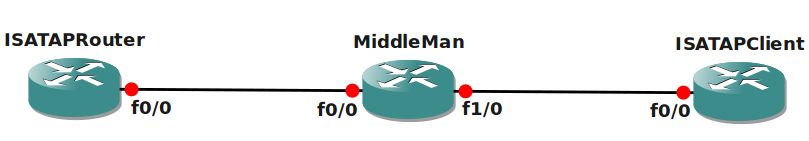

# IPv6 ISATAP

## Scenario

You are working as the network engineer for an Asian based company and responsible for the deployment of IPv6. You heard some good things about this new protocol and are interested in the new autoconfiguration feature, let's see if you can configure this.

## Goal

* All IPv4 addresses have been preconfigured for you.
* OSPFv2 has been configured to ensure full connectivity for IPv4.
* Configure a tunnel0 interface on router ISATAPRouter and set mode to ISATAP.
* Configure IPv6 address 2001::1/64 on the tunnel0 interface and use EUI-64 for the last 64 bits.
* Make sure router advertisements are sent through the tunnel0 interface.
* Make sure source updates are sent from the Loopback0 interface on router ISATAPRouter.
* Configure a tunnel0 interface on router ISATAPClient and set the correct tunnel mode.
* Source updates should be sent from the Fastethernet0/0 interface, Destination should be Loopback0 of router ISATAPRouter.
* Ensure the IPv6 address on router ISATAPClient will be automatically configured.

## IOS

c3640-jk9s-mz.124-16.bin

## Topology

## Video Solution

[Video Solution on YouTube](http://www.youtube.com/watch?v=HLwgzF7zpgU)
