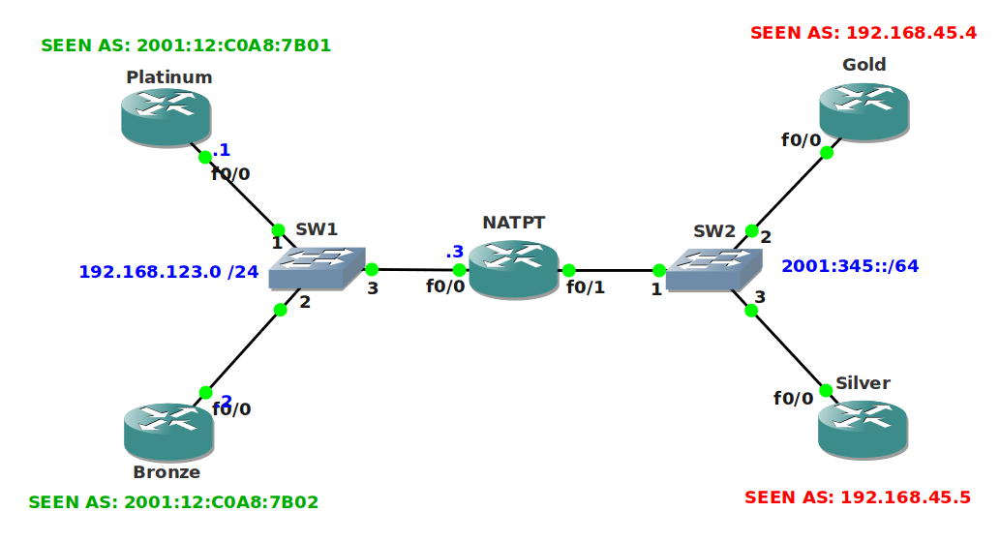

# IPv6 NAT-PT Static

## Scenario

You are working for a large international mining company and responsible for the migration strategy towards IPv6. The ISP has run out of IPv4 addresses and can only supply you with fresh new IPv6 addresses. In order to connect the new "Gold" and "Silver" sites you will need to perform NAT-PT...start digging!

## Goal

- All IPv4 and IPv6 addresses have been preconfigured for you.
- All routers have a default route towards router NATPT.
- Configure NAT-PT and make sure router Platinum is reachable as 2001::C0A8:7B01.
- Configure NAT-PT and make sure router Bronze is reachable as 2001::C0A8:7B02.
- Configure NAT-PT and make sure router Gold is reachable as 192.168.123.4.
- Configure NAT-PT and make sure router Silver is reachable as 192.168.123.5.
- Your configuration is correct when you have full connectivity.

## IOS

```
c3725-adventerprisek9-mz.124-15.T7.bin
```

## Topology



## Video Solution

[YouTube Video Solution](http://www.youtube.com/watch?v=-fVr2Z1Pzc4)
