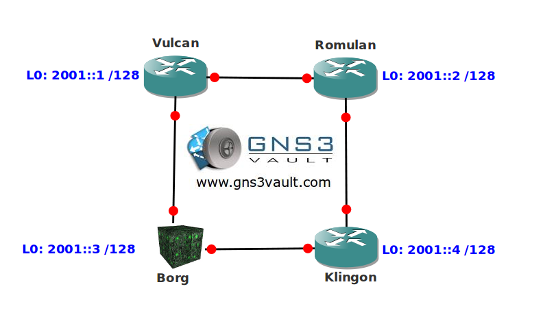

# IPv6 Static Route

## Scenario

After waking up from cryosleep the year appears to be 2020 and there is not a single IPv4 address left on the planet. The last thing you remember are the stories about the end of IPv4 and the migration plans for IPv6...now it seems this is all reality! It's up to you to configure static routes and make the network operational...resistance is futile ;)

## Goal

- You are not allowed to use IPv4 addresses.
- You are not allowed to use any IPv6 global unicast addresses except the ones on the loopback interfaces.
- Use the MAC-address for the last 64 bits of the IPv6 addresses required for the FastEthernet links.
- Create a static route on router Vulcan to reach 2001::2 /128.
- Create a static route on router Romulan to reach 2001::1 /128. You are not allowed to specify a link-local IPv6 address as next-hop but you are allowed to add additional IPv6 global unicast addresses for this particular task.
- Create a static route on router Klingon to reach 2001::3/128. The static route should have an administrative distance of 50.

## IOS

c3640-jk9s-mz.124-16.bin

## Topology

## Video Solution

http://www.youtube.com/watch?v=dqieHEdAqDY
