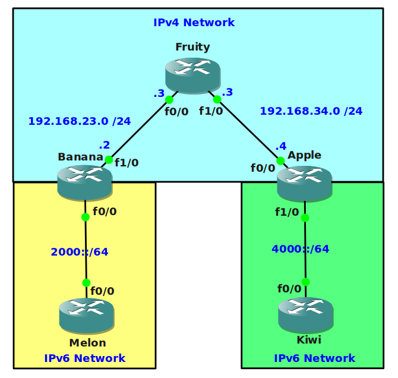

# IPv6 Tunneling over IPv4

## Scenario

You are the senior network designer for a large enterprise company specialized in exporting Fruit. The company has plans to upgrade their network and to ensure they are ready for the future they want to implement IPv6. The backbone of the network however is still based on IPv4 and you are not allowed to make any changes...let's see if you can achieve connectivity by tunneling...

## Goal

- All IPv4 and IPv6 addresses have been preconfigured for you.
- You are not allowed to make any changes to router Fruity.
- OSPFv2 has been configured in the IPv4 domain for connectivity between the routers.
- Configure a IPv6 over IPv4 tunnel between router Banana and Apple. You are allowed to use the 3000::/64 prefix for the tunnel interface.
- Enable RIPNG on router Melon, Banana, Apple and Kiwi.
- Ensure you have full connectivity between the 2000::/64 and 4000::/64 network.

## IOS

c3640-jk9s-mz.124-16.bin

## Topology

## Video Solution

[Video: IPv6 Tunneling over IPv4](http://www.youtube.com/watch?v=w24mG5WtjUM)
