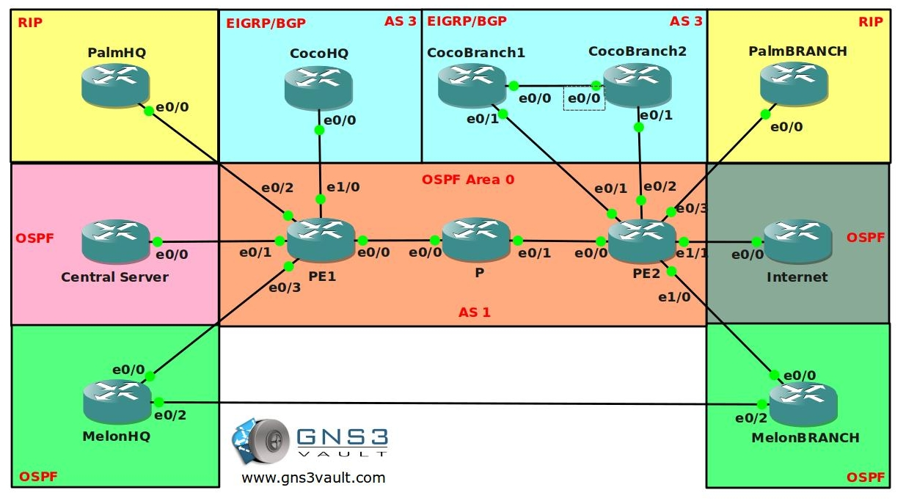

# Advanced MPLS VPN

## Scenario

After winning the lottery you thought your networking days would be over...with the millions you have won you bought your own tropical island. After weeks of sipping cocktails you got bored of doing nothing and decided to start your own ISP. Soon after starting the business it didn't take long before the first customers came along, now it's up to you to configure the whole MPLS backbone and help your customers setting up their routers. Good luck!

## Goal

### MPLS Backbone Configuration

- All IP addresses have been preconfigured for you in the following format:
  - **Ethernet interfaces**: 192.168.XY.X /24, for example 192.168.12.X between router 1 and 2.
  - **Loopback interfaces**:
    - L0: X.X.X.X /24, for example: 1.1.1.1 for router 1.
    - L1: XX.XX.XX.XX /24, for example: 11.11.11.11 for router 1.
    - You can see the router "numbers" if you click on the 'show hostnames' button in GNS3.

- Configure OSPF process 1 on router PE1, P and PE2. Advertise the links between PE1 P PE2.
- Advertise the loopback0 interfaces in OSPF as well.
- Ensure you never send OSPF messages for OSPF process 1 on the links outside the backbone.
- Configure MPLS on router PE1, P and PE2. Make sure you don't configure MPLS on the links outside the backbone.
- Configure authentication for MPLS, use password "cisco".
- Configure MP-BGP between router PE1 and PE2, use AS1 and source updates from the loopbacks.
- Configure the correct VPN4 address-family in BGP between router PE1 and PE2.

### Customer 1: "Palm Club"

Your first customer "Palm Club" just signed a contract with you, they have a HQ and 1 Branch office that needs to be connected through the MPLS cloud.

- Create a VRF called "PALM" on router PE1 and PE2.
- Use a Route Distinguisher (RD) of 111:111.
- Use a Route Target (RT) of 111:111.
- Make sure the interfaces on the PE routers towards the PALM routers are put into the correct VRF.
- Configure RIP on router PalmHQ and PalmBRANCH, advertise the link towards the ISP and the Loopback0 interface.
- Configure RIP on router PE1 and PE2 and use the correct VRF.
- Ensure RIP updates are being exchanged between the customer and the PE routers.
- Configure redistribution between RIP and BGP on the PE routers, make sure you use the correct VRF.
- Ensure you can ping each others loopback0 interfaces from router PalmHQ and PalmBRANCH.

### Customer 2: "Melons 'r' Us"

"Melons 'r' Us" heard great stories about you from "Palm Club" and decided to sign a contract with you as well. They have a HQ and Branch office as well and there is a link between the 2 sites. Your MPLS connection is much faster so they want to use MPLS as their main connection and the other link for backup.

- Create a VRF called "MELON" on router PE1 and PE2.
- Use a Route Distinguisher (RD) of 222:222.
- Use a Route Target (RT) of 222:222.
- Make sure the interfaces on the PE routers towards the MELON routers are put into the correct VRF.
- Configure OSPF process 2 on router MelonHQ and MelonBRANCH, advertise the link towards the ISP and the Loopback0 interface.
- Advertise the link between router MelonHQ and MelonBRANCH in OSPF as well.
- Configure OSPF on router PE1 and PE2 and use the correct VRF.
- Ensure OSPF updates are being exchanged between the customer and the PE routers.
- Configure redistribution between OSPF and BGP on the PE routers, make sure you use the correct VRF.
- Ensure you can ping each others loopback0 interfaces from router MelonHQ and MelonBRANCH.
- Increase the ospf cost on the E0/2 interface on both Melon routers to 100.
- Try a traceroute from router MelonHQ towards MelonBRANCH. As you can see all traffic is being sent through the backup link and not the MPLS cloud.
- Ensure all traffic is sent through the MPLS cloud, you are only allowed to make changes on the PE routers.

### Customer 3: "Coco Loco"

Your company keeps growing and the third customer "Coco Loco" signed a contract with you. They have 2 sites; a HQ and a branch with 2 routers. Their situation is slightly more complex since they use EIGRP and BGP.

- Create a VRF called "COCO" on router PE1 and PE2.
- Use a Route Distinguisher (RD) of 333:333.
- Use a Route Target (RT) of 333:333.
- Make sure the interfaces on the PE routers towards the COCO routers are put into the correct VRF.
- Configure EIGRP AS3 on router CocoHQ and the two CocoBRANCH routers, advertise the link towards the ISP and the Loopback0 interface.
- Advertise the link between router CocoBRANCH1 and CocoBRANCH2 in EIGRP as well.
- Configure EIGRP on router PE1 and PE2 and use the correct VRF.
- Ensure EIGRP updates are being exchanged between the customer and the PE routers.
- Configure redistribution between EIGRP and BGP on the PE routers, make sure you use the correct VRF.
- Ensure you can ping each others loopback0 interfaces from router CocoHQ and CocoBRANCH1 & 2.
- The Coco Branch site might cause problems because it's multihomed, configure the PE routers to filter any duplicate prefix advertisements. (Hint: EIGRP SOO)
- Configure BGP AS3 on router CocoHQ and the two CocoBRANCH routers, advertise the link towards the ISP and the Loopback1 interface. "Coco Loco" wants to use the same AS number on both sites.
- Configure router PE2 so AS3 will accept it's own AS number.
- Configure router CocoHQ so it will accept it's own AS number.
- Advertise the link between router CocoBRANCH1 and CocoBRANCH2 in BGP as well.
- Configure BGP on router PE1 and PE2 to connect with the Coco routers, make sure you use the correct VRF.
- Ensure you can ping each others loopback1 interfaces from router CocoHQ and CocoBRANCH1 & 2.
- The Coco Branch site might cause problems because it's multihomed, configure the PE routers to filter any duplicate prefix advertisements. (Hint: BGP SOO)

### Security Enhancement

You just hired a security officer and the first thing he complained about is that your customers are able to see the IP addresses of the MPLS routers in the Cloud, you need to do something about it...

- Change the configuration of the MPLS Backbone so when you do a trace from router MelonHQ to MelonBRANCH you only see the PE routers.

### Inter-Customer Connectivity

All your customers are now connected to the MPLS cloud, and they are very satisfied with your services. "Palm Club" and "Melons 'r' Us' decided to become business partners and they need access to each HQ's.

- Configure PE1 so PalmHQ and MelonHQ see each others routes. Ensure you have reachability by pinging 2.2.2.2 from PalmHQ using the loopback0 as source interface.

### Central Server Setup

"Palm Club" and "Coco Loco" are complaining that you don't offer any other services except the MPLS VPN. You decide to install a central server for e-mail. The server is located in the 9.9.9.0 /24 network.

- Create a VRF called "CENTRALSERVER" on router PE1.
- Use a Route Distinguisher (RD) of 444:444.
- Use a Route Target (RT) of 444:444.
- Make sure the interface on the PE router towards the CENTRALSERVER router is put into the correct VRF.
- Configure OSPF process 3 on router PE1 and CENTRALSERVER, advertise the loopback interfaces on router CENTRALSERVER.
- Create a Route Target (RT) to export the CENTRALSERVER networks, use RT: 123:123
- Create a Route Target (RT) to export the networks of the Palm and Coco routers, use RT: 456:456
- Import the Route Target with the Palm and Coco networks into the CENTRALSERVER VRF.
- Import the Route Target with the CENTRALSERVER network in the Palm and Coco VRF.
- Ensure you have connectivity between Palm and CENTRALSERVER.
- Ensure you have connectivity between Coco and CENTRALSERVER.
- Test this by pinging the 9.9.9.9 IP address from the Coco and Palm sites.
- Ensure Palm and Coco do NOT have connectivity between each other.
- Configure a selective VRF export on router PE1 so the 99.99.99.0 /24 network is not exported.

### Internet Gateway

"Coco Loco" and "Palm Club" ask you if you also offer Internet services through the MPLS cloud, you think this is a good idea so you decide to add a Gateway for Internet access.

- Create a VRF called "INTERNET" on router PE2.
- Use a Route Distuingisher (RD) of 555:555.
- Create additional route-targets to make sure the Palm Club and Coco Loco sites are able to access the Internet.

## IOS

c3640-jk9o3s-mz.124-16.bin

## Topology

## Video Solution

[Video Solution: Advanced MPLS VPN](http://www.youtube.com/watch?v=E4uVmkqKDCo)
