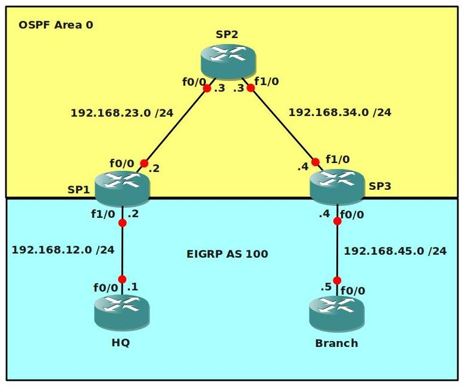

# Basic MPLS VPN

## Scenario

Service provider "StoryTellers" is intrigued by your performance so far, before they allow you to even look at their production MPLS backbone there is another lab they would like you to configure. By using MPLS VPN's it's possible to send customer routes over the provider network. OSPF will be configured in the service provider domain (Router SP1, SP2 and SP3), the customer will be using EIGRP.

## Goal

- Configure all IP addresses as specified in the topology picture.
- Configure a loopback0 interface on each router:
  - HQ: 1.1.1.1 /25
  - SP1: 2.2.2.2 /25
  - SP2: 3.3.3.3 /25
  - SP3: 4.4.4.4 /25
  - BRANCH: 5.5.5.5 /25
- Configure OSPF Area 0 at the provider side (Router SP1, SP2 and SP3).
- Advertise the loopback interfaces as well in OSPF.
- Ensure you have full reachability in the OSPF domain.
- Configure MPLS on all physical interfaces in the service provider domain, do not configure MPLS on physical interfaces pointing towards the customer.
- Force MPLS to use the loopback interface as router-id.
- Configure VRF "customer" on SP1 and SP3 as following:
  - RD 100:1
  - Route-target both 1:100
- On router SP1 and SP3 add the interfaces pointing towards the customer to the VRF you just created.
- Ensure you can ping from within the VRF, try this as following on SP1:
  - `ping vrf customer 192.168.12.1`
- Configure EIGRP AS 100 on router HQ and Branch. Advertise the loopbacks as well.
- Disable EIGRP auto-summary.
- Configure EIGRP on router SP1 and SP3 for the correct VRF "customer".
- Ensure you have established a EIGRP neighbor relationship between Router HQ and SP1, and between SP3 and Branch.
- See if you have learned routes by using `show ip route vrf customer`.
- Configure BGP AS 1 between Router SP1 and SP3, make sure updates are sourced from the loopback interface.
- Configure the correct BGP address families and make sure communities are sent between neighbors.
- Redistribute EIGRP into BGP, use the correct address-family for the VRF "customer".
- Redistribute the information from BGP back into EIGRP, use the following metrics:
  - bandwidth: 64kbps
  - delay: 1000
  - reliability: 255
  - load: 1
  - MTU: 1500
- Ensure you have full connectivity between router HQ and Branch. You should see each other's EIGRP routes that have been carried over the service provider's MPLS backbone.
- Optional: Replace the Customer's EIGRP with OSPF / RIP or BGP and achieve the same result.

## IOS

c3640-jk9s-mz.124-16.bin

## Topology

## Video Solution

- http://www.youtube.com/watch?v=EULFOF__V8c
- http://www.youtube.com/watch?v=G6btbIO0-DM
- http://www.youtube.com/watch?v=JJppnyuqL6I
