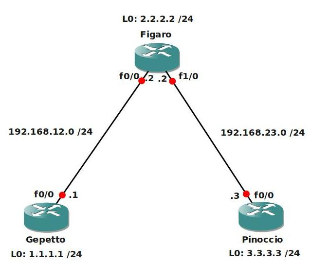

# Frame Mode MPLS

## Scenario

You are working as a network engineer at an ISP called "StoryTellers" and until now you have been responsible for the Frame-Relay network of this service provider. Since MPLS is becoming more popular every day, you are being moved from the Frame-Relay team to the MPLS team...you do need to upgrade your skills though, so it's time to start with a basic MPLS lab and see what it's all about.

## Goal

- All IP addresses are preconfigured as specified in the topology picture.
- Configure EIGRP AS 100 and advertise all networks, ensure you have full reachability.
- Perform a traceroute from Router Gepetto to the Loopback0 interface of Pinoccio. Take a good look at this trace so you can compare it to the MPLS traceroute (hint: copy/paste this information into notepad).
- Configure MPLS on all physical interfaces, do NOT configure MPLS on the loopback interfaces.
- Use the "show mpls ldp bindings" command to check what labels are being used for all networks.
- Are these labels the same or different on all routers? why?
- Perform a traceroute from Router Gepetto to Pinoccio's Loopback0 interface, what is the difference compared to the traceroute you did before?

## IOS

c3640-jk9s-mz.124-16.bin

## Topology

## Video Solution

http://www.youtube.com/watch?v=Kg5xfbl0h_c
