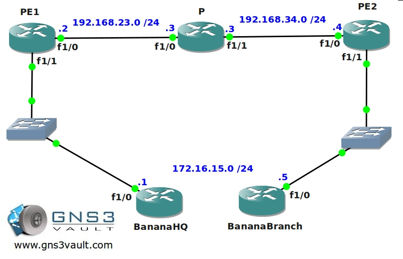

# MPLS AtoM / Pseudowire Ethernet over MPLS (EoMPLS)

## Scenario

One of the largest service providers in The Netherlands has been successfully implementing MPLS in their backbone. The last years they have been serving customers with PE-CE setups without any problem. Yesterday a new customer specialized in selling Bananas arrived who is not looking for a PE-CE solution but rather would see an end-to-end Ethernet solution. Since the ISP has never configured this before they ask you; A respected Cisco Guru to implement MPLS AtoM (Any Type over MPLS) for them. Let's see if you can pull this one off!

## Goal

- All IP addresses have been preconfigured for you.
- All ISP routers have a loopback0 interface configured as following:
  - PE1: 2.2.2.2 /25
  - P: 3.3.3.3 /25
  - PE2: 4.4.4.4 /25
- Configure OSPF Area 0 at the provider side (Router PE1, PE2 and P).
- Advertise the loopback interfaces as well in OSPF.
- Make sure you don't send any OSPF Hello packets towards the customer.
- Ensure you have full reachability in the OSPF domain.
- Configure MPLS on all physical interfaces in the service provider domain, do not configure MPLS on physical interfaces pointing towards the customer.
- Configure the PE routers to encapsulate every frame in a MPLS packet and to forward it to the other PE router using VC ID 15.
- Make sure router BananaHQ and BananaBranch can ping each other.

## IOS

c7200-adventerprisek9-mz.124-20.T.bin

## Topology

## Video Solution

[MPLS AtoM / Pseudowire Ethernet over MPLS (EoMPLS) - Video](http://www.youtube.com/watch?v=gNVGr-3p0u0)
