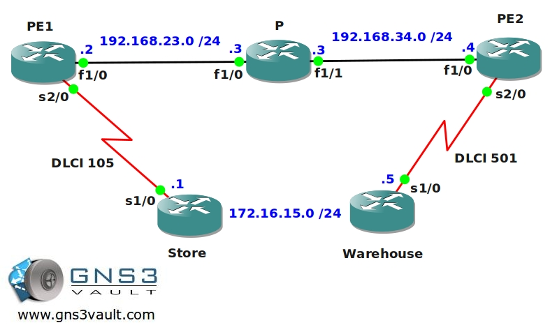

# MPLS AtoM / Pseudowire Frame-Relay over MPLS (FoMPLS)

## Scenario

Molenaar Furniture is a wholesaler of furniture & more and located in The Netherlands. Recently the company has been expanding their business by taking it online. The warehouse needs to be connected to the store to make sure inventory can be updated real-time at the store's website. The company sites are currently connected by using Frame-Relay but the provider doesn't support these links anymore. It is however possible to hook up the Frame-relay links to the MPLS Backbone so these connections can be supported in the future. Let's see if you can tag this one...

## Goal

* All IP addresses have been preconfigured for you.
* All ISP routers have a loopback0 interfaced configured as following:
  - PE1: 2.2.2.2 /25
  - P: 3.3.3.3 /25
  - PE2: 4.4.4.4 /25
* Configure OSPF Area 0 at the provider side (Router PE1, PE2 and P).
* Advertise the loopback interfaces as well in OSPF.
* Make sure you don't send any OSPF Hello packets towards the customer.
* Ensure you have full reachability in the OSPF domain.
* Configure MPLS on all physical interfaces in the service provider domain, do not configure MPLS on physical interfaces pointing towards the customer.
* Router Store and Warehouse have been preconfigured with a DLCI number:
  - Store: DLCI 105
  - Warehouse: DLCI 501
* Configure the PE routers so you have end-to-end Frame-Relay connectivity over the MPLS Backbone, you are not allowed to make any changes to router P.
* Make sure router Store and Warehouse can ping each other.

## IOS

`c7200-adventerprisek9-mz.124-20.T.bin`

## Topology

## Video Solution

[MPLS AtoM / Pseudowire Frame-Relay over MPLS (FoMPLS) Video Solution](http://www.youtube.com/watch?v=QYejOszFAOI)
