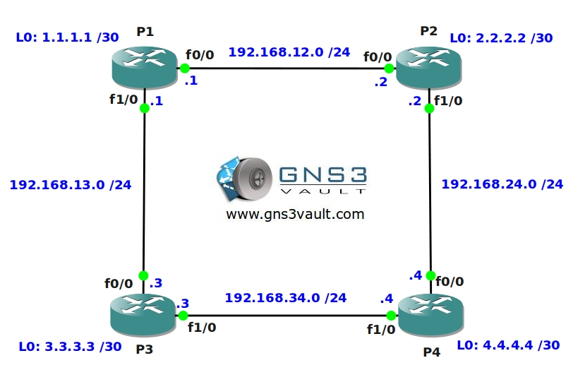

# MPLS LDP

## Scenario

As the senior network engineer for a small ISP you are responsible for all new network services. New customers are requesting MPLS services and so you decide to implement a new network. You want to start with the Core of this network so you take a couple of brand new routers and create a new MPLS Backbone with P (Provider) routers. Let's see if you can implement MPLS...

## Goal

- All IP addresses on the customer routers have been preconfigured for you.
- OSPF has been configured on all routers and all networks are advertised.
- Configure router P2, P3 and P4 to activate MPLS an IETF standard MPLS protocol.
- Configure router P1 to enable the same MPLS protocol without using the 'mpls ip' command.
- Configure all routers so only label range 20 - 200 will be used.
- Configure router P1 to use the IP address on the F0/0 interface as the MPLS Router-ID.
- Configure all routers to send the MPLS Hello every 2 seconds, the holdtime should be 10 seconds.
- Configure router P3 and P4 to establish the LDP connection between their fastethernet interfaces.
- Configure all routers to use MPLS MD5 authentication, the password should be "VAULT".
- The TTL from IP packets should be copied into the label on all routers.
- Advertise a default route on router P2.
- Make sure that there is also a label advertised for the default route.
- There should be a hop count for LDP, set the maximum hop to be 10 on all routers.
- Change the maximum MTU for labeled packets on router P1's interface F0/0 to 2000.

## IOS

c3640-jk9s-mz.124-16.bin

## Topology

## Video Solution

http://www.youtube.com/watch?v=IU1EURkw07o
