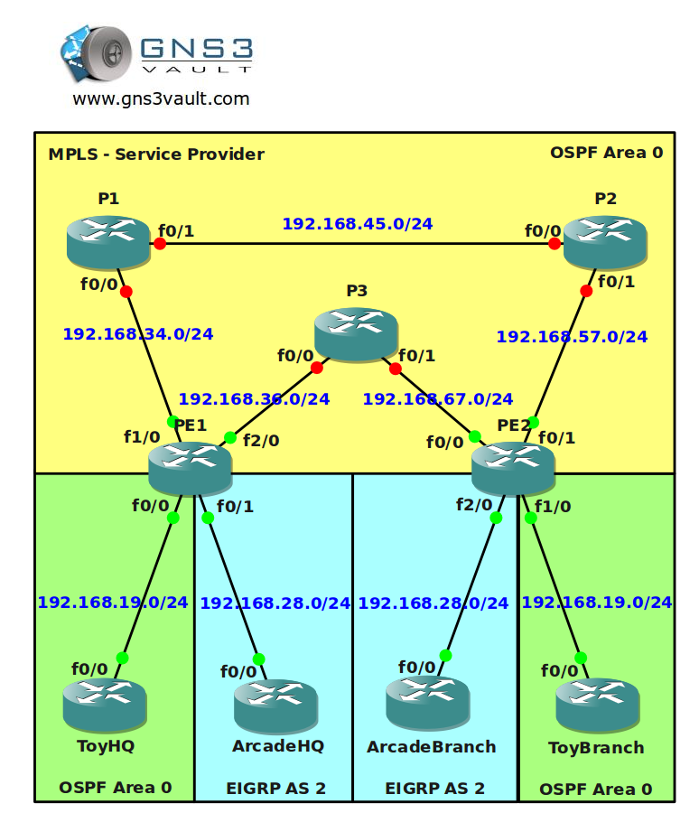

# MPLS Traffic Engineering per L2TPV3

## Scenario

You are the senior network engineer for a large MPLS provider based in the United Kingdom. 2 of your customers called "Toy" and "Arcade" would like to use your MPLS services to connect their HQ and branch offices. Your MPLS backbone has multiple routers and one of the problems you encounter is that there is no load-sharing within the MPLS cloud. Your customers are connecting the sites using pseudowires and this is something you don't want to change. Make sure your customers can use pseudowires and that you can use load balancing within your MPLS backbone. See if you can tag this one...

## Goal

All IP addresses have been preconfigured for you.

- Every router has a loopback0 interfaced configured.
- Configure OSPF Area 0 at the provider side (Router PE1, PE2, P1, P2 and P3).
- Advertise the loopback interfaces as well in OSPF.
- Make sure you advertise the loopback0 interfaces as /24 instead of the default /32 or you will run into trouble.
- Ensure you have full reachability in the OSPF domain.
- Configure MPLS on all physical interfaces in the service provider domain, do not configure MPLS on physical interfaces pointing towards the customer.
- Configure BGP AS 1 between Router PE1 and PE2.
- Configure the correct BGP address families and make sure communities are sent between neighbors.
- Configure a pseudowire on PE1 and PE2 to connect ToyHQ and ToyBranch.
- Configure a pseudowire on PE1 and PE2 to connect ArcadeHQ and ArcadeBranch.
- Configure OSPF Area 0 on router ToyHQ and ToyBranch. Advertise the loopbacks as well.
- Configure EIGRP AS 2 on router ArcadeHQ and ArcadeBranch. Advertise the loopbacks as well.
- Make sure you have an OSPF adjacency between the 2 Toy routers.
- Make sure you have an EIGRP adjacency between the 2 EIGRP routers.
- Ensure you have full connectivity for the customer networks. ToyHQ and ToyBranch should exchange OSPF prefixes and ArcadeHQ and ArcadeBranch should exchange EIGRP prefixes.
- At this moment you should have a working MPLS network but all traffic is being sent through P3. We are going to use MPLS traffic engineering to use P1 and P2 as well.
- Configure a tunnel10 interface on router PE1 and PE2 for VRF Toy. Make sure the tunnel is in MPLS traffic engineer mode.
- Configure the hold and setup priority to 1 for the tunnel 10 interface, set the bandwidth to 2000.
- Configure a tunnel11 interface on router PE1 and PE2 for VRF Arcade. Make sure the tunnel is in MPLS traffic engineer mode.
- Configure the hold and setup priority to 1 for the tunnel 11 interface, set the bandwidth to 2000.
- Configure the RSVP bandwidth to 2000 for all links interconnecting the P and PE routers.
- Configure MPLS traffic engineering tunnel support for all links interconnecting the P and PE routers.
- Finish your configuration so traffic for customer Toy is sent from PE1 through P1 and P2.
- Finish your configuration so traffic for customer Arcade is sent from PE1 through P3 and P2.

## IOS

c3725-adventerprisek9_ivs-mz.124-15.T13
