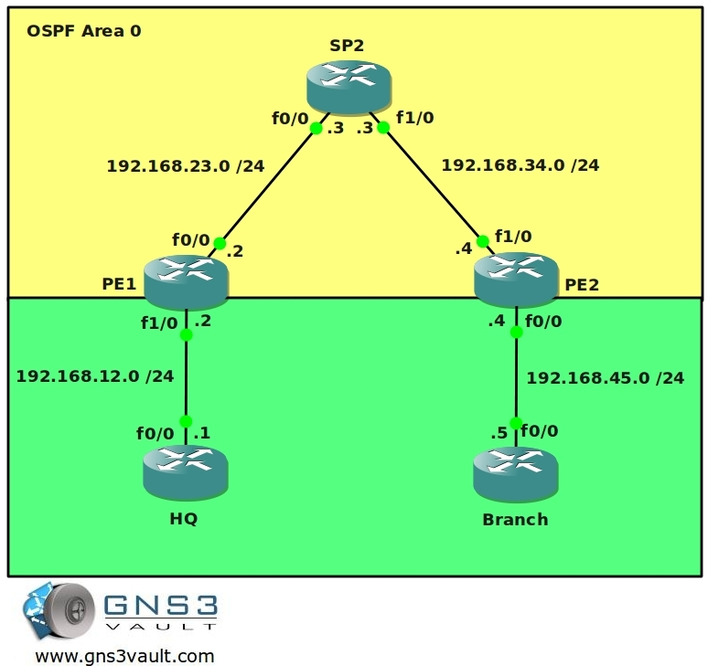

# MPLS VPN PE CE using RIP



## Scenario

You have been dreaming of starting your own ISP for years and now the moment is finally here. You bought a couple of brand new routers and you are about to implement your MPLS backbone. Your first customer has just signed a contract for connecting two sites so there is nothing stopping you. One of your routers will be the "P" router for the backbone. The other two routers will be used as "PE" router to connect the customer's end devices. Your customer is running RIP as their (IGP) internal routing protocol. Your backbone will use OSPF as the IGP....time to create your business!

## Goal

* All IP addresses have been preconfigured for you.
* Every router has a loopback0 interface configured as follows:
  - HQ: 1.1.1.1 /25
  - PE1: 2.2.2.2 /25
  - P2: 3.3.3.3 /25
  - PE2: 4.4.4.4 /25
  - BRANCH: 5.5.5.5 /25
* Configure OSPF Area 0 at the provider side (Router PE1, PE2 and P).
* Advertise the loopback interfaces as well in OSPF.
* Ensure you have full reachability in the OSPF domain.
* Configure MPLS on all physical interfaces in the service provider domain, do not configure MPLS on physical interfaces pointing towards the customer.
* Configure VRF "customer" on PE1 and PE2 as follows:
  - RD 100:1
  - Route-target both 1:100
* On router PE1 and PE2 add the interfaces pointing towards the customer to the VRF you just created.
* Ensure you can ping from within the VRF, try this as follows on PE1:
  ```
  ping vrf customer 192.168.12.1
  ```
* Configure RIP on router HQ and Branch. Advertise the loopbacks as well.
* Make sure you use RIP version 2.
* Disable RIP auto-summary.
* Configure RIP on router PE1 and PE2 for the correct VRF "customer".
* Ensure you receive prefixes from the customer routers on your PE routers.
* Configure BGP AS 1 between Router PE1 and PE2.
* Configure the correct BGP address families and make sure communities are sent between neighbors.
* Redistribute RIP into BGP, use the correct address-family for the VRF "customer".
* Make sure you keep the original metric for the prefixes.
* Ensure you have full connectivity between router HQ and Branch. You should see each other's RIP routes that have been carried over the service provider's MPLS backbone.

## IOS

* c3640-jk9s-mz.124-16.bin

## Topology

## Video Solution

* [MPLS VPN PE CE using RIP Video Solution](http://www.youtube.com/watch?v=gxsx-EmXV5U)
