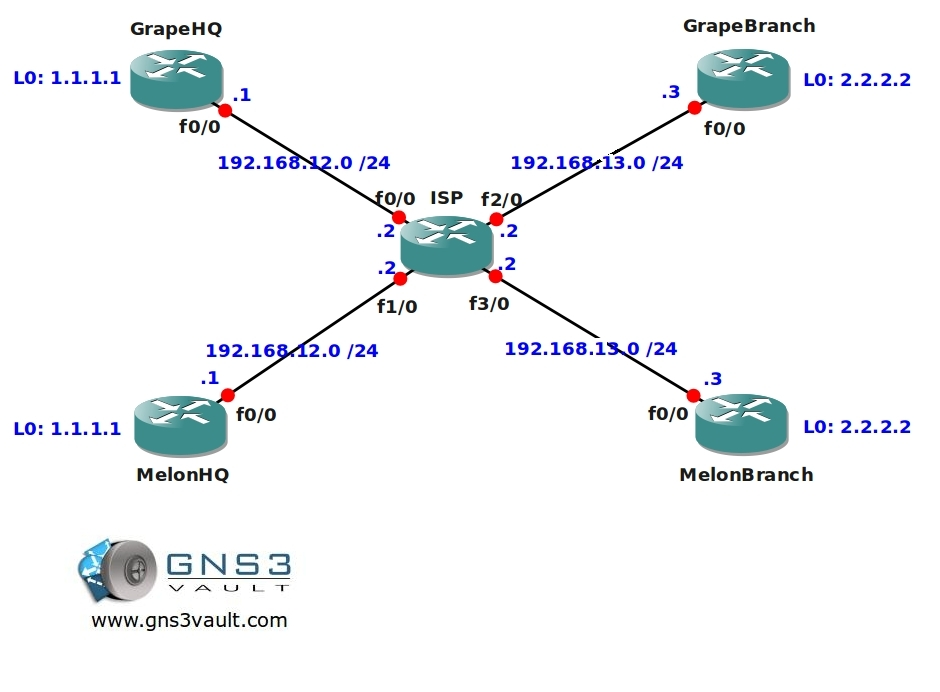

# VRF Lite

## Scenario

You are running a small ISP on a tropical location somewhere in the pacific, recently two new customers have arrived and they both have 2 sites to connect. There's a headquarters (HQ) and a branch office and they want to use OSPF as the routing protocol. One of the problems you are facing is that both customers are using the same IP addressing scheme and it's impossible to change this. You also have to make sure that there is NO connectivity between the two companies. You believe vrf might be the solution to your problems...if you are able to pull this off you'll be rewarded with an infinite amount of grapes and melons from your customers...time to work!

## Goal

* All IP addresses on the customer routers have been preconfigured for you.
* You are not allowed to change the IP addressing scheme in this topology.
* Configure the ISP router so you can ping router MelonHQ and MelonBranch.
* Configure the ISP router so you can ping router GrapeHQ and GrapeBranch.
* Configure OSPF Area 0 on router ISP, MelonHQ and MelonBranch, advertise all networks.
* Configure OSPF Area 0 on router ISP, GrapeHQ and GrapeBranch, advertise all networks.
* Router MelonHQ and MelonBranch should see each other's loopback networks.
* Router GrapeHQ and GrapeBranch should see each other's loopback networks.
* The Melon and Grape routers should NOT see each others routes and there should be no connectivity between them.

## IOS

c3640-jk9s-mz.124-16.bin

## Topology

## Video Solution

http://www.youtube.com/watch?v=kR66WPUbgy0
