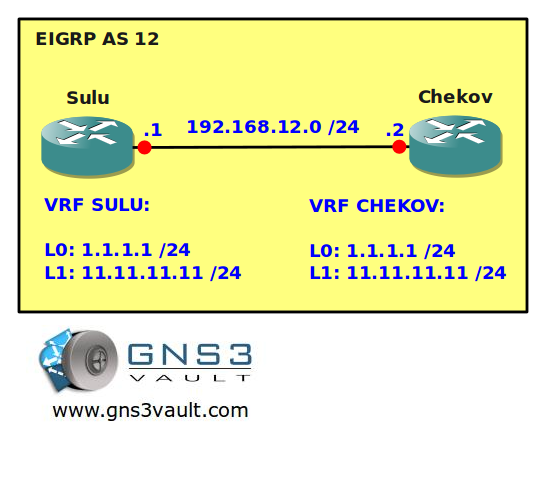

# VRF Routing

## Scenario

As the captain of an interstellar spaceship you are responsible for the well-being of your ship. You need to setup a secure line to exchange information between your crewmembers. You are going to use a technique that was created 200 years ago called VRF Routing. Back then this technique was the basis of MPLS and you need to make sure your crewmembers fully understand it before they dive deeper into MPLS....engage!

## Goal

All IP addresses have been preconfigured for you.

- Router Sulu and Chekov both have a loopback0 and loopback1 interface we are going to use for VRFs.
- Configure VRF SULU on router Sulu, add the loopback0 and loopback1 interface to this VRF.
- Configure VRF CHEKOV on router Chekov, add the loopback0 and loopback1 interface to this VRF.
- Configure the tunnel1 interface on both routers. Make sure the source and destination IP addresses of the Fastethernet link are used for this.
- Make sure the tunnel1 interface is added to VRF SULU and CHEKOV.
- Configure the 192.168.21.0 /24 subnet on the tunnel1 interface.
- Configure EIGRP AS 12 as the routing protocol for these VRFs. Make sure both routers can ping each others loopback interfaces.

## IOS

c3640-jk9o3s-mz.124-16.bin

## Topology

## Video Solution

[Video Solution on YouTube](http://www.youtube.com/watch?v=1ggrVqnKGAw)
