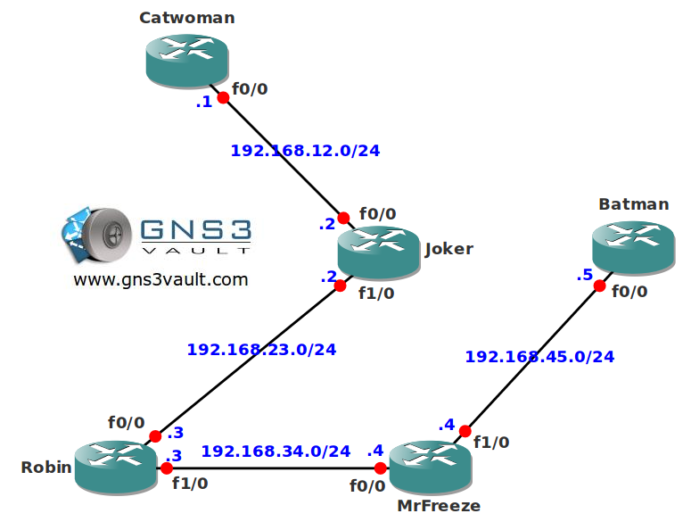

# Multicast Auto-RP Listener

## Scenario

Gotham City once again needs your help, one of your colleagues decided to change the configuration on all routers to "sparse-mode" instead of "sparse-dense-mode". Some villain hacked your routers last week and you didn't notice, the command "sparse-dense-mode" is not available anymore...you will need to fix the network or the citizens won't be able to watch the latest videos of action replays.

## Goal

* All IP addresses have been preconfigured for you.
* Configure OSPF on all routers, advertise all networks. Achieve full connectivity.
* Configure sparse-mode multicast on all routers.
* Configure AutoRP so router Joker is the Rendezvous Point (RP), use the loopback0 interface.
* Configure AutoRP so router Joker is also the mapping agent (MP), use the loopback0 interface.
* Configure router Batman to join the multicast group 224.4.4.4 on it's Fastethernet interface.
* Make sure you can ping the 224.4.4.4 group address from router Catwoman.
* You are not allowed to manually configure the RP address on any router.

## IOS

* c3640-jk9s-mz.124-16.bin

## Topology

## Video Solution

* [Video: Multicast Auto-RP Listener Solution](http://www.youtube.com/watch?v=hR_vf8hbuwI)
