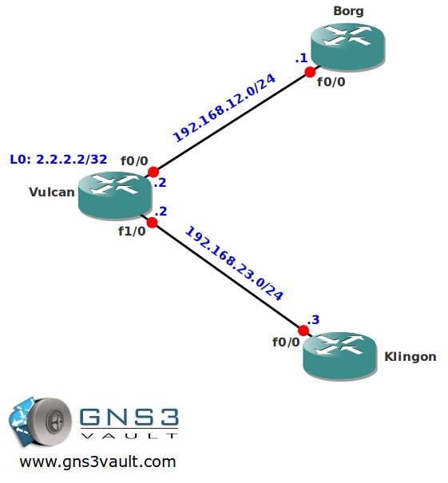

# Multicast PIM Accept RP

## Scenario

Since you are a excellent network engineer at the company you are working for, the network rarely has any problems and you have plenty of spare time. One of the days you were slacking off at the job and you implemented multicast on some of the routers to stream Star Trek videos across the network. Unfortunately some of your network colleagues found out and they are streaming some of their own videos using your configured rendezvous point (RP). Time to fix this before your the network is cluttered with useless video streams, after all you want your network career to be long and prosper...

## Goal

* All IP addresses have been preconfigured for you.
* Configure OSPF on all routers, achieve full connectivity.
* Configure sparse-mode multicast on all routers.
* Configure router Vulcan to be the rendezvous point (RP) in your network, use the loopback0 interface.
* Configure router Klingon to join the following 2 multicast groups:
  * 224.1.1.1 (Star Trek videos)
  * 224.2.2.2 (Company's funniest home videos)
* Configure router Vulcan so it only accepts the Star Trek video multicast group.
* Test this by pinging 224.1.1.1 and 224.2.2.2 from router Borg.

## IOS

c3640-jk9s-mz.124-16.bin

## Topology

## Video Solution

[Watch on YouTube](http://www.youtube.com/watch?v=m7IvlPV25IM)
