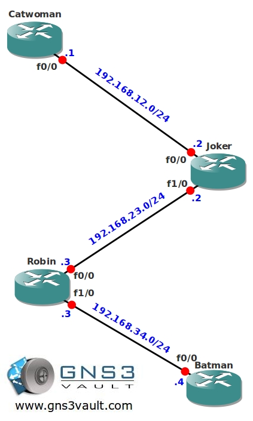

# Multicast PIM Bootstrap Router

## Scenario

You are a network engineer and responsible for the main network of Gotham City. Multicast will be needed to send video replays throughout the city, and to decrease network load your boss has decided that you need to implement sparse-dense-mode. The network will be fairly large, so you don't want to configure the RP address manually on every router, the network might contain non-Cisco router in the future so you'll need to use a standards-based protocol.

## Goal

- All IP addresses on the physical interfaces have been preconfigured for you.
- Configure a loopback interface on router Joker:
  Loopback0: 2.2.2.2/32
- Configure a loopback interface on router Robin:
  Loopback0: 3.3.3.3/32
- Configure a loopback interface on router Batman:
  Loopback0: 4.4.4.4/32
- Configure OSPF on all routers, advertise all networks. Achieve full connectivity.
- Configure sparse-dense-mode multicast on all routers.
- Configure Bootstrap so router Joker is the Rendezvous Point (RP), use the loopback0 interface.
- Configure router Batman to join the multicast group 224.4.4.4 on it's loopback0 interface.
- Make sure you can ping the 224.4.4.4 group address from router Catwoman.

## IOS

c3640-jk9s-mz.124-16.bin

## Topology

## Video Solution

[View Solution on YouTube](http://www.youtube.com/watch?v=CNcu2vAi7HY)
