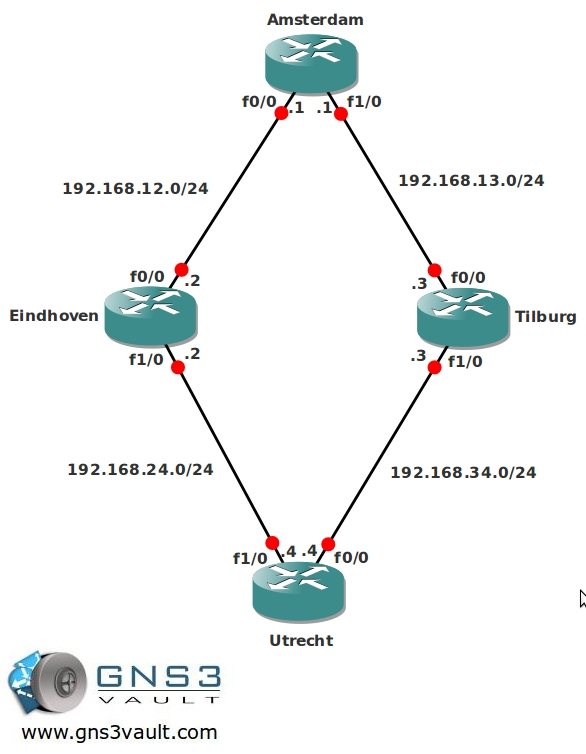

# Multicast PIM Dense Mode

## Scenario

You are working for a big Dutch company specialized in delivering Video-over-IP to their Customers. Since almost all customers are using their connection to receive video, the company decided to implement Multicast. To gain experience with the operation of Multicast they decided to implement Dense mode.

## Goal

- All IP addresses have been preconfigured for you.
- Configure OSPF on all routers, achieve full connectivity.
- Configure dense-mode multicast on all routers.
- Configure router Utrecht to join the multicast group 224.4.4.4 on its Fastethernet 1/0 interface.
- Ping this multicast group address from 224.4.4.4 from router Amsterdam to test your multicast configuration.

## IOS

c3640-jk9s-mz.124-16.bin

## Topology

## Video Solution

[Video Solution on YouTube](http://www.youtube.com/watch?v=6sdaElU--8g)
