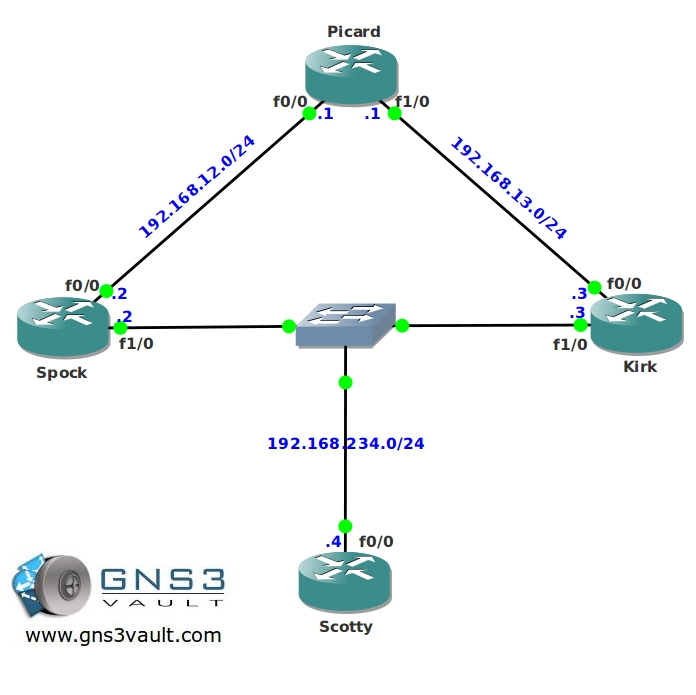

# Multicast PIM DR Election

## Scenario

Your have been streaming Star Trek videos by using multicast on your corporate network for quite some time without anyone noticing...recently one of your colleagues found you out...he's going to tell your boss unless you agree to him and stream some of his favorite Star Wars videos as well. You don't want to make a lot of changes to the network, but router Spock will not enough capacity to send this much traffic, you will need to change router Kirk to be the Designated Router (DR) for our multicast setup....may the force be with you...

## Goal

* All IP addresses have been preconfigured for you.
* Configure OSPF on all routers, achieve full connectivity.
* Configure sparse-mode multicast on all routers.
* Configure router Picard to be the rendezvous point (RP) in your network, use the loopback0 interface.
* Configure router Picard to be the mapping agent (MP) in your network, use the loopback0 interface.
* Configure router Scotty to join the following multicast group: 224.1.1.1
* Start a ping from router Picard to the multicast group address 224.1.1.1 to generate traffic.
* Make sure router Spock is the Designated Router (DR) and forwards multicast traffic towards router Scotty.

## IOS

c3640-jk9s-mz.124-16.bin

## Topology

## Video Solution

[http://www.youtube.com/watch?v=PX18OqVh52w](http://www.youtube.com/watch?v=PX18OqVh52w)
