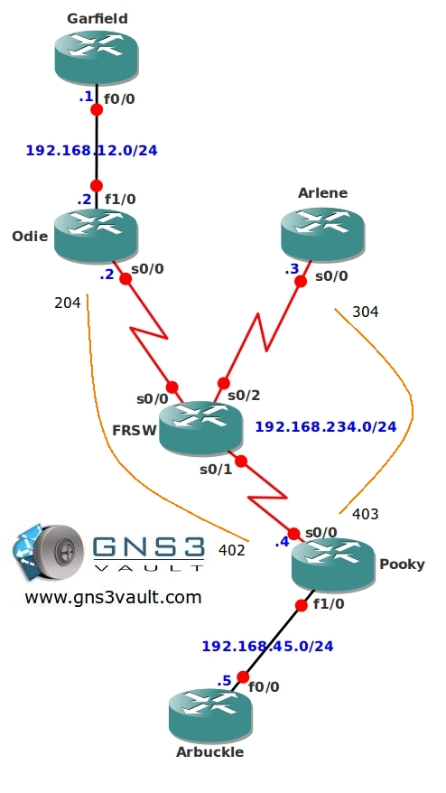

# Multicast PIM NBMA Mode

## Scenario

As a full-time IT instructor at a high school you are always busy with innovative ideas. The school network is pretty old and has a frame-relay network, your idea is to stream old school cartoon videos on the network but you are running into some problems when you configure multicast on this network...Do you think you can fix it or will one of the students need to help you?

## Goal

- Frame-relay has been configured as following:
  - Router Pooky will be the HUB
  - Router Odie and Arlene will be the SPOKE routers
  - Router Pooky (DLCI 402) ↔ Router Odie (DLCI 204)
  - Router Pooky (DLCI 403) ↔ Router Arlene (DLCI 304)

- Configure EIGRP on all routers, achieve full connectivity. Fix any problems that the frame-relay setup might cause to your EIGRP configuration.
- Configure PIM sparse multicast mode on all your routers.
- Configure router Arbuckle to be Rendezvous Point (RP) for this network, use the loopback0 interface.
- Configure router Arbuckle to be Mapping Agent (MP) for this network, use the loopback0 interface.
- Configure router Arlene to join the following multicast group: 224.1.1.1
- Start a ping from router Arbuckle to the multicast group address 224.1.1.1 to generate traffic, make sure you get a response.
- Start a ping from router Garfield to the multicast group address 224.1.1.1, make sure you get a response from router Arlene.

## IOS

- c3640-jk9s-mz.124-16.bin

## Topology

## Video Solution

http://www.youtube.com/watch?v=jBNzfDa5rXk
