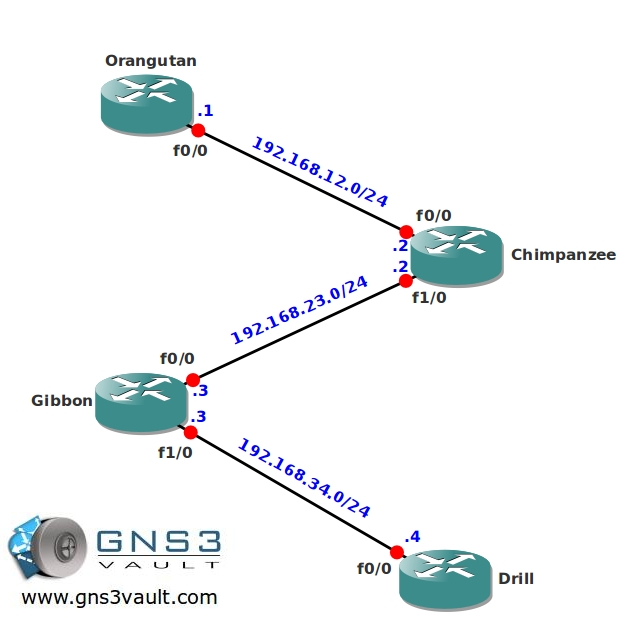

# Multicast PIM Sparse-Dense Mode

## Scenario

As a volunteer working at a huge Monkey Reserve located in The Netherlands you decide to capture videos of all the monkeys and send them over the network to interested paying customers. This way you can aid the Reserve with some of the financial problems they have been dealing with...time for some Monkey Business!

## Goal

- All IP addresses have been preconfigured for you.
- Configure OSPF on all routers, advertise all networks. Achieve full connectivity.
- Configure sparse-dense-mode multicast on all routers.
- Configure all routers manually so that router Gibbon is the Rendezvous Point (RP) only for the 224.4.4.4 multicast group. Use the loopback0 interface as the IP address for the RP.
- Configure router Drill to join the multicast group 224.4.4.4 on it's Fastethernet interface.
- Configure router Drill to join the multicast group 239.4.4.4 on it's Fastethernet interface.
- Make sure you can ping the 224.4.4.4 group address and 239.4.4.4 group address from router Orangutan.

## IOS

c3640-jk9s-mz.124-16.bin

## Topology

## Video Solution

http://www.youtube.com/watch?v=rVHJf5RbK4A
