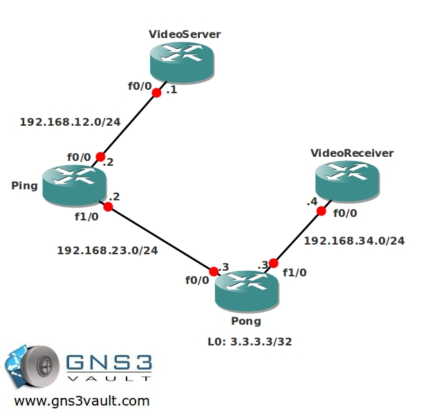

# Multicast PIM Sparse Mode

## Scenario

Being a big table tennis fan and professional network engineer you decide to enhance your company's network by adding Multicast. This way everyone can enjoy the latest video replays of your sports action. Multicast Dense might burden the network with too much multicast traffic so you decide to implement Multicast Sparse Mode, hopefully your boss won't find out...

## Goal

- All IP addresses have been preconfigured for you.
- Configure OSPF on all routers, advertise all networks. Achieve full connectivity.
- Configure sparse-mode multicast on all routers.
- Configure all routers manually so that router Pong is the Rendezvous Point (RP).
- Configure router VideoReceiver to join the multicast group 224.4.4.4 on its FastEthernet interface.
- Make sure you can ping the 224.4.4.4 group address from router VideoServer.

## IOS

c3640-jk9s-mz.124-16.bin

## Topology

## Video Solution

[Video Solution on YouTube](http://www.youtube.com/watch?v=uK43VRNrMd8)
