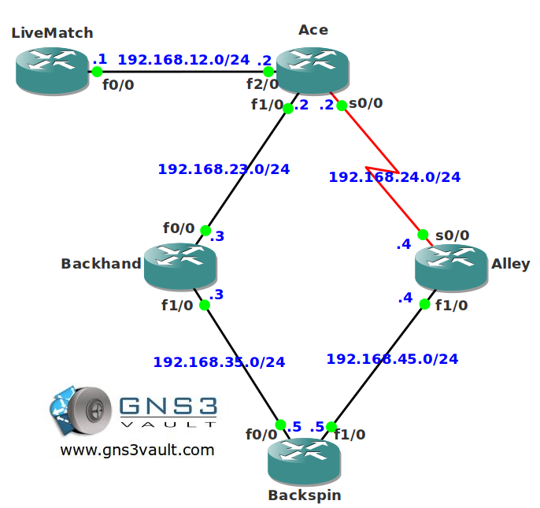

# Multicast RPF Failure

## Scenario

As one of the network engineers for a national Tennis organization you are responsible for all Multicast operations. Multicast is vital for the organization because video replays of all Tennis matches are being sent within the company. Without Multicast the network will be burdened by traffic overhead.

## Goal

* Configure OSPF on all routers, advertise all networks. Achieve full connectivity.
* Configure dense-mode multicast only on routers LiveMatch, Ace, Alley and Backspin.
* Configure router Backspin to join the multicast group 224.4.4.4 on its FastEthernet interface.
* Make sure you can ping the 224.4.4.4 group address from router LiveMatch. You are not allowed to configure Multicast on router Backhand.

## IOS

c3640-jk9s-mz.124-16.bin

## Topology

## Video Solution

[Multicast RPF Failure Video Solution](http://www.youtube.com/watch?v=JHPd9hoa-Xs)
